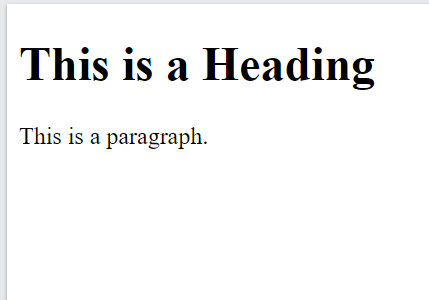

# 1. How to create modules in in python :smile:
Hello , in this lesson we will lern more how to use markdown to create a engaging readme.
# 2. what will we learn in this lesson:cd:

- how to create a markdown file 
- how to lern a markdown syntax
- how to format code in markdown 
- how to embed images in markdown 
# Extention we need are 
1. **github** markdown preview by *matt briener*
2. Mark down emoji by mart briner
# Emojin  links
[you can find all the emojis here:](https:www.webfx.com/tools/emoji-cheat-sheet)

# Other markdown editors you can use 
1. mac **macDown**
2. windows: **ghostwriter** or **markdowneditor**
# Our program :ghost:
 to load an image use an exlamation mark and squre brackets **![alternate text]**
 eg  
 *piccture1: just an exmaple of image*
 To show our code using markdown you can use backticks `` for single code 
    `print("hello world")`
    *to show multiple lies of codes use three backticks 

```html
<style>
div {
  background-color: lightgrey;
  width: 300px;
  border: 15px solid green;
  padding: 50px;
  margin: 20px auto;
}
</style>
```
For  our main entry code 
```html
<!DOCTYPE html>
<html>
<head>
<title>Page Title</title>
</head>
<body>

<h1>This is a Heading</h1>
<p>This is a paragraph.</p>

</body>
</html>
```
Running the program we get the following output 




That's how you can create a nicely READ.md file for Github you can find the link to this project here:
**github** [github link](https://github.com/kimtechnos/README.md-file.git)